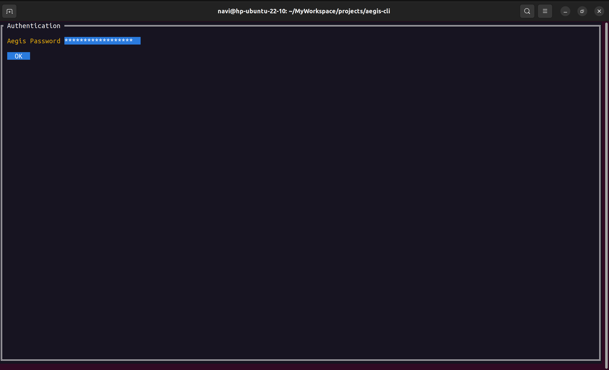

# aegis-cli
Command-line interface to generate 2FA from Aegis' json file

# How to use

## 1. Install

<details>
<summary><b>Linux</b></summary>

Download:
* [x86_64](https://github.com/navilg/aegis-cli/releases/latest/download/aegis-cli-linux-x86_64) Intel or AMD 64-Bit CPU
  ```shell
  curl -L "https://github.com/navilg/aegis-cli/releases/latest/download/aegis-cli-linux-x86_64" \
       -o "aegis-cli" && \
  chmod +x "aegis-cli"
  ```
* [arm64](https://github.com/navilg/aegis-cli/releases/latest/download/aegis-cli-linux-arm64) Arm-based 64-Bit CPU (i.e. in Raspberry Pi)
  ```shell
  curl -L "https://github.com/navilg/aegis-cli/releases/latest/download/aegis-cli-linux-arm64" \
       -o "aegis-cli" && \
  chmod +x "aegis-cli"
  ```

> To determine your OS version, run `getconf LONG_BIT` or `uname -m` at the command line.

Move:
```shell
sudo mv aegis-cli /usr/bin/aegis-cli
```

</details>

<details>
<summary><b>macOS</b></summary>

Download:
* [x86_64](https://github.com/navilg/aegis-cli/releases/latest/download/aegis-cli-macos-x86_64) Intel 64-bit
  ```shell
  curl -L "https://github.com/navilg/aegis-cli/releases/latest/download/aegis-cli-macos-x86_64" \
       -o "aegis-cli" && \
  chmod +x "aegis-cli"
  ```
* [arm64](https://github.com/navilg/aegis-cli/releases/latest/download/aegis-cli-macos-arm64) Apple silicon 64-bit
  ```shell
  curl -L "https://github.com/navilg/aegis-cli/releases/latest/download/aegis-cli-macos-arm64" \
       -o "aegis-cli" && \
  chmod +x "aegis-cli"
  ```

> To determine your OS version, run `uname -m` at the command line.

Move:
```shell
mv aegis-cli ~/Applications/aegis-cli
```

Tip:

* Add `~/Applications/` to your `$PATH`
    ```shell
    echo 'export PATH="$HOME/Applications/:$PATH"' >> ~/.zshrc
    ```
* Or, add `~/Applications/aegis-cli` as alias for `aegis-cli`
    ```shell
    echo 'alias aegis-cli="$HOME/Applications/aegis-cli"' >> ~/.zshrc
    ```

</details>

## 2. Export

Export vault (encrypted) from your mobile app and put the vault file on your system under `$HOME/.config/aegis-cli` with filename `aegis.json`.

## 3. Execute

Execute aegis cli:

```shell
aegis-cli
```

# Screeshots




# Aegis design and architecture

AES 256 in GCM mode is used as AEAD cipher.

Scrypt is used as the KDF with N=2^15, r=8 and p=1

Vault is encrypted using 256-bit master key. This master key is encrypted with credential in stored in slot. This process is called key wrapping.


Vault format:

```json
{
    "version": 1,
    "header": {},
    "db": {}
}
```

db contains vault content. If its encrypted, Its value is base64 encoded (with padding) ciphertext of vault content. If its not encrypted, Its in json format.

Header contains `slots` and `params`. 

```json
{
    "slots": [],
    "params": {
        "nonce": "0123456789abcdef01234567",
        "tag": "0123456789abcdef0123456789abcdef"
    }
}
```

params contains `nonce` and `tag` that was produced during encryption encoded as hexadecimal string.

Slot is of three type. Type 1 is raw, Type 2 is password and Type 3 is biometric.